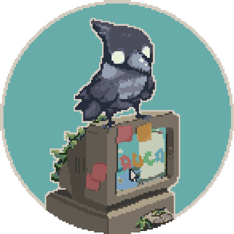
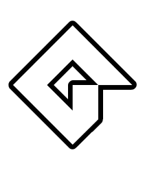
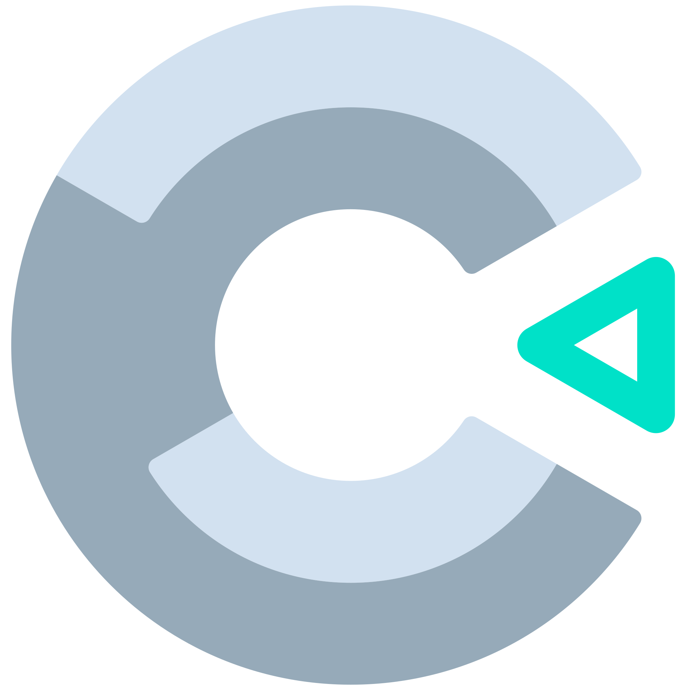

##
  

      
  

    
    
    
    
    
    

##

 
  <a href="https://mduca.itch.io" target="_blank">
  

##

  <h3>Hi! Below you can see some of the projects that I developed in my currently journey.</h3>

