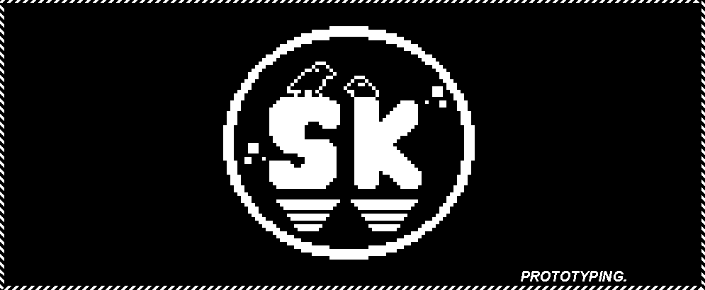

**`(Desenvolvedor de Jogos // Game Programmer)`**

      
  

 
<h3>Sobre</h3>

      

 
<h3>About</h3>

---
### 🔗 Links:

 
  <a href="https://sktheu.itch.io" target="_blank">
  
  

### 🧰 Engines & Tools:

    
    
    
    
    
    

### 🧠 Languages:

