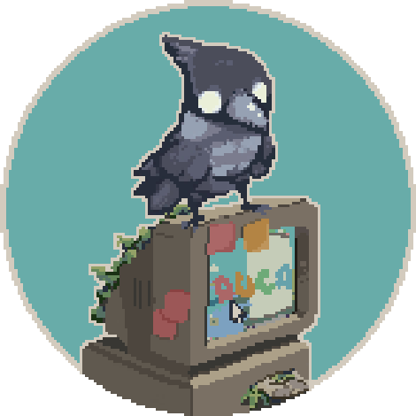

<!-- Start Logo / Contacts -->

  
   
  
  
  

<!-- End Logo / Contacts -->

 

<!-- Start Intro -->

<h3 align="center">👋 Opa, tranquilo? Eu sou o Duca</h3>

  Sou um desenvolvedor que está focando em <b>Backend com Java e Spring</b>.
   
  Utilizando minha experiência de <b>+1 ano em projetos comerciais no setor de Games</b>
  como base para essa nova etapa da minha carreira.

<!-- End Intro -->

 

<!-- Start Main Stack -->

<h3 align="center">
  
  Stack Atual
</h3>

  

<!-- End Main Stack -->

 

<!-- Start Languages -->

<h3 align="center">
  
  +Linguagens
</h3>

  
  
  

<!-- End Languages -->

 

<!-- Start Technologies -->

<h3 align="center">
  
  +Tecnologias
</h3>

  
  
  
  
  
   
  
  
  

<!-- End Technologies -->

 

<!-- Start Projects -->

  Aqui você encontrará <b>Projetos Comerciais</b>, <b>Pessoais</b>,
  <b>Acadêmicos</b>, <b>Game Jams</b> e <b>Protótipos / Demos</b>.

<h3 align="center">🔻 Confira os projetos abaixo 🔻</h3>
<!-- End Projects -->
